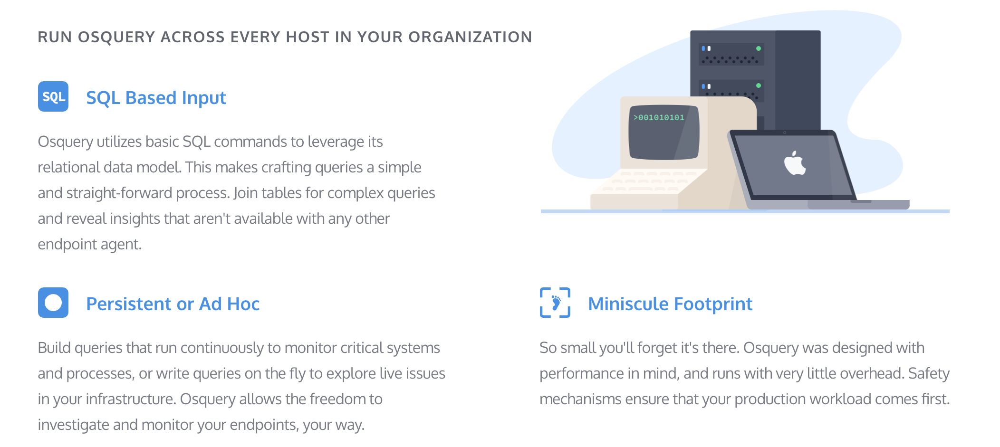

The Osquery Launcher 
====================

The Osquery Launcher is a lightweight launcher/manager which offers a few extra capabilities on top of osquery:

- secure automatic updates of osquery
- remote communication via a modern gRPC server API
- a curated `kolide_best_practices` table which includes a curated set of standards for the modern enterprise
- tooling to generate deployment packages for a variety of platforms

## Features

### Secure Osquery Autoupdater

Osquery is statically linked and that allows for the easy bundling and distribution of capabilities. Unfortunately, however, it also implies that you have to maintain excellent osquery update hygiene in order to take advantage of emerging osquery capabilities.

The Launcher includes the ability to securely manage and autoupdate osquery instances. This is implemented using [The Update Framework (TUF)](https://theupdateframework.github.io/). TUF defines a [specification](https://github.com/theupdateframework/tuf/blob/develop/docs/tuf-spec.md) for secure software update systems. The spec describes a client/server model where the client is the software to be updated and the server is the update server. For our implementation, we use [Docker Notary](https://github.com/docker/notary) as our TUF server and a Go client library that [we built in-house](https://github.com/kolide/updater).

Because we understand the security implications of an osquery autoupdater, NCC Group was contracted to perform a [security audit]() of our in-house TUF client library. NCC Group has also previously performed assessments on [Docker Notary](https://www.nccgroup.trust/us/our-research/docker-notary/) and [Osquery](https://www.nccgroup.trust/us/about-us/newsroom-and-events/blog/2016/march/ncc-group-reviews-osquery/) as well.

### gRPC Server Specification and Implementation

Osquery has a very extensible plugin architecture that allow it to be heavily customized with plugins. The included TLS plugins are used by many existing osquery management servers, but the design of the TLS API leaves much to be desired. The Launcher includes a set of gRPC plugins for remote communication with a gRPC server. The [server specification](https://github.com/kolide/agent-api) is independently published and versioned.

An implementation of the gRPC server is included with the [Kolide Fleet](https://github.com/kolide/fleet) osquery fleet manager. Kolide Fleet implements both the gRPC server as well as the legacy TLS server API, so it presents an easy migration path for existing TLS API users.

### Kolide's Best Practices

Osquery allows you to ask a lot of great questions, but sometimes it's hard to know exactly which questions you should ask and what queries will expose the answers. The Launcher includes a table called `kolide_best_practices` which aggregates useful information in an easy "compliant" vs "not compliant" interface. Consider the following queries:

-	`select gatekeeper_enabled from kolide_best_practices`
- `select remote_login_disabled from kolide_best_practices`
- `select screensaver_password_enabled from kolide_best_practices`

The following best practices, and many more, are included:

- Is SIP enabled?
- Is Filevault enabled?
- Is the firewall enabled?
- Are [Remote Apple Events](https://support.apple.com/kb/PH18721?locale=en_US) disabled?
- Is Internet Sharing disabled?

### Reduced Configuration Surface

The osqueryd binary was designed to be very configurable, which allows it to be used in very different environments. The Launcher wraps osqueryd configuration and exposes very high-level options that allow you to easily connect osquery to a server that is compliant with the [gRPC specification](https://github.com/kolide/agent-api/blob/master/agent_api.proto) (such as [Kolide Fleet](https://github.com/kolide/fleet)).

To learn about The Launcher's command-line interface, see the Launcher [documentation](./cmd/launcher/README.md).

### Easy Packaging and Deployment Tooling

Deploying osquery and configuring it to communicate with a management server can be complicated, especially if you have to make customized deployment packages. The Launcher includes a tool called `package-builder` which you can use to create Launcher packages for your organization.

Take the headache out of deploying osquery and check out the [documentation](./cmd/package-builder/README.md).
