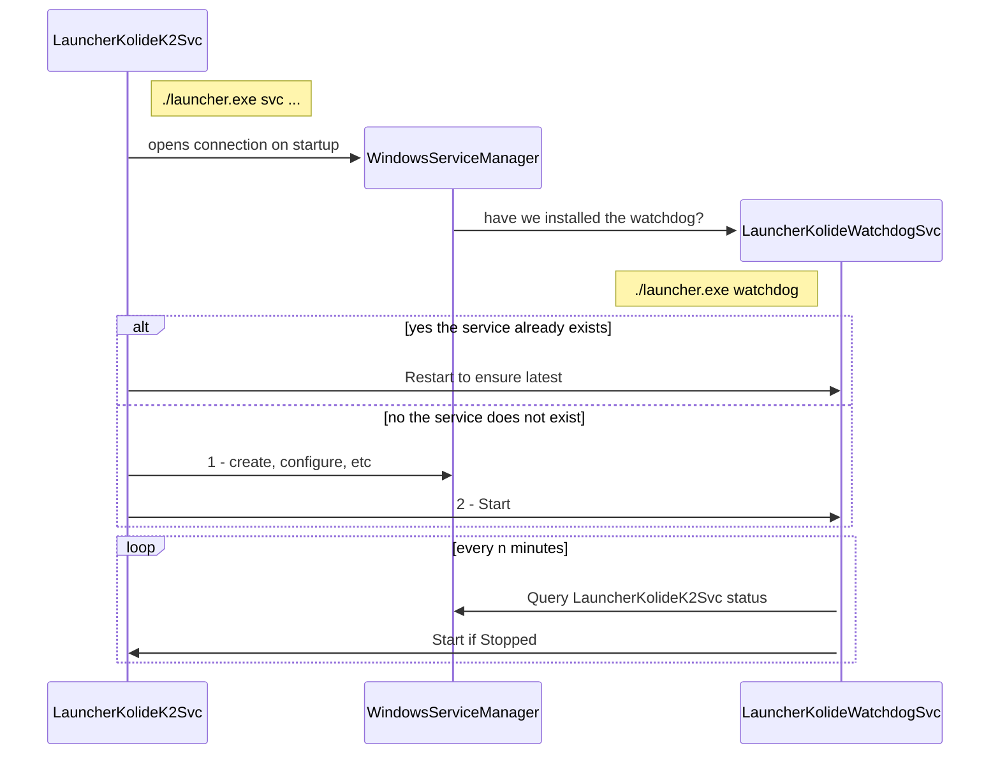

```mermaid
sequenceDiagram
    participant LauncherKolideK2Svc
    Note right of LauncherKolideK2Svc: ./launcher.exe svc ...
    create participant WindowsServiceManager
    LauncherKolideK2Svc->>WindowsServiceManager: opens connection on startup
    create participant LauncherKolideWatchdogSvc
    WindowsServiceManager->>LauncherKolideWatchdogSvc: have we installed the watchdog?
    Note left of LauncherKolideWatchdogSvc: ./launcher.exe watchdog

    alt yes the service already exists
        LauncherKolideK2Svc->>LauncherKolideWatchdogSvc: Restart to ensure latest
    else no the service does not exist
        LauncherKolideK2Svc->>WindowsServiceManager: 1 - create, configure, etc
        LauncherKolideK2Svc->>LauncherKolideWatchdogSvc: 2 - Start
        activate LauncherKolideWatchdogSvc
    end

    loop every n minutes
        LauncherKolideWatchdogSvc->>WindowsServiceManager: Query LauncherKolideK2Svc status
        LauncherKolideWatchdogSvc->>LauncherKolideK2Svc: Start if Stopped
    end
```