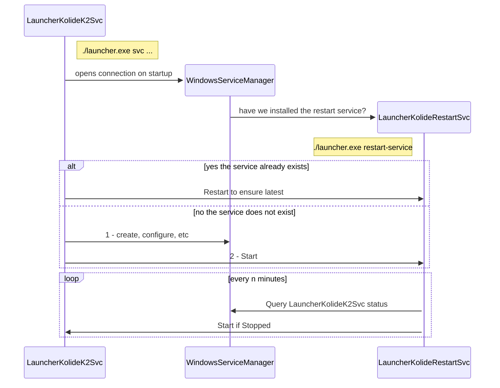

## Overview

### TODO
- add logging + publish via sqlite
- add health checking mechanism from launcher proper
- add scheduled task to kick health checker service
- add uninstallation commands for service + scheduled task

### Future Work
- add similar functionality for non-windows platforms
- add health check history to flares
