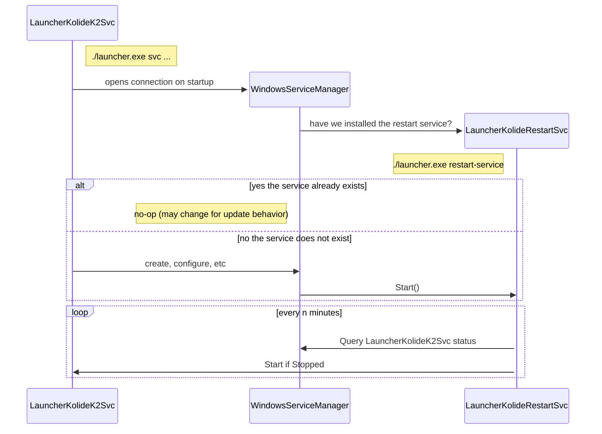

```mermaid
sequenceDiagram
    participant LauncherKolideK2Svc
    Note right of LauncherKolideK2Svc: ./launcher.exe svc ...
    create participant WindowsServiceManager
    LauncherKolideK2Svc->>WindowsServiceManager: opens connection on startup
    create participant LauncherKolideRestartSvc
    WindowsServiceManager->>LauncherKolideRestartSvc: have we installed the restart service?
    Note left of LauncherKolideRestartSvc: ./launcher.exe restart-service

    alt yes the service already exists
        Note left of WindowsServiceManager: no-op (may change for update behavior)
    else no the service does not exist
        LauncherKolideK2Svc->>WindowsServiceManager: create, configure, etc
        WindowsServiceManager->>LauncherKolideRestartSvc: Start()
        activate LauncherKolideRestartSvc
    end

    loop every n minutes
        LauncherKolideRestartSvc->>WindowsServiceManager: Query LauncherKolideK2Svc status
        LauncherKolideRestartSvc->>LauncherKolideK2Svc: Start if Stopped
    end
```