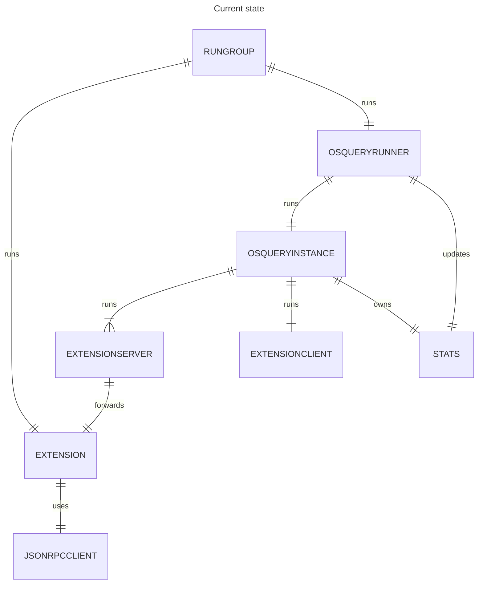
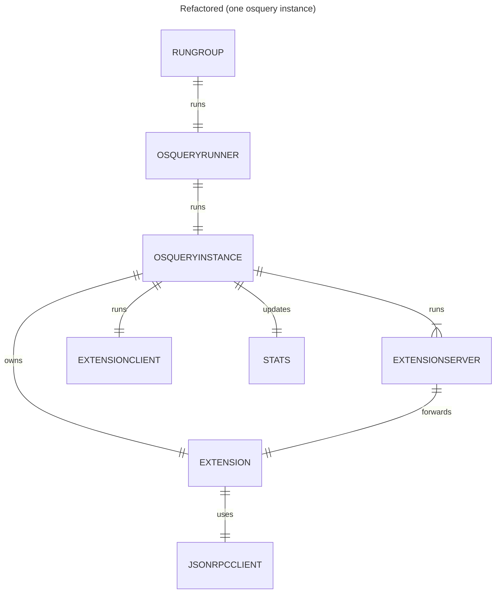
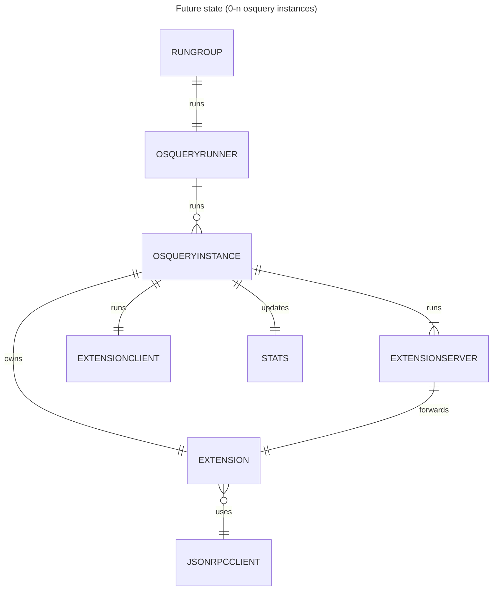

# Osquery extension, runner, and instance refactor

## Status

2024-10-23: ADR submitted to team.
2024-11-04: Implementation complete.

## Context

Throughout this ADR, `osquery instance` refers to the `OsqueryInstance` struct that is responsible for running the osquery process and its extension servers, and providing access to the process via the extension client. The `osquery process` refers specifically to the process created by execing the osqueryd binary. The `osquery runner` or `runner` refers to the `Runner` struct that is responsible for managing the osquery instance. The `osquery extension` refers primarily to the `Extension` struct, which is used by the `kolide_grpc` plugin. The table plugin is largely elided from discussion here, as that extension is much more trivial to move around in the codebase.

We want to be able to run between 0 and n osquery processes; currently, we run exactly one. In the short term, we want to be able to split up where Kolide queries run versus where tenant queries run, so that if a tenant creates a query that causes issues with the osquery process, the Kolide queries will still run. (This amounts to running 2 osquery processes.) In the longer term, we want to support multitenant installations. This will mean 1 osquery process for Kolide queries, and 1 osquery process per tenant. We will accomplish this by running 1 osquery instance for Kolide queries, and 1 osquery instance per tenant.

### Current implementation

In our current implementation, the extension is created by `runLauncher` and run via our rungroup, and passed into the osquery runner for use when creating the osquery instances. To run multiple osquery instances using our _current_ implementation, we have two choices:

1. We could share one osquery extension with all osquery instances
2. We could create multiple extensions inside `runLauncher` and pass them into the runner to distribute one per osquery instance

Ultimately, I rejected both of these options as unsuitable.

We don't want to share the osquery extension among all osquery instances -- we will be unable to identify which osquery instance is talking to the extension, which makes this option untenable. Additionally, we may run into socket contention issues.

Creating multiple extensions in `runLauncher` and passing them into the runner requires some tedious mapping to make sure we tie the correct extension to the correct osquery instance. This option would also require a full launcher restart if the runner needed to increase the number of osquery instances running (for example, if a single-tenant launcher enrolls with a new tenant to become a multi-tenant launcher); I think requiring a full restart is unnecessary and undesirable in this case.

Therefore, we will want to refactor our current implementation with the following goals in mind:

1. We want one osquery extension per osquery instance
2. We want to be able to add new osquery instances without requiring a full launcher restart
3. We do not want onerously complex setup for the osquery instances or their extensions, since our osquery process management and osquery data exchange is already a complicated system

## Decision

To simplify the creation of multiple osquery instances, and to make it possible to increase the number of osquery instances running without performing a full launcher restart, we will move the osquery extension ownership to the osquery instance.

This will also give us the opportunity to make the separation of responsibility between the runner and the instance clearer. The instance will create its own extension, extension server, etc. The instance will be responsible for its own stats -- creating them during launch, and updating them during instance shutdown. The runner will be responsible for the instances' state.

The below diagram shows the desired future state -- it is identical to the above diagram except for the relationship cardinalities (e.g. `OSQUERYRUNNER` runs 0 or more of `OSQUERYINSTANCE`, rather than exactly 1 `OSQUERYINSTANCE`).

## Consequences

As a result of having multiple extensions, we will have more goroutines to manage, more CPU overhead, and the potential for Windows sleep to get in the way in more places.

The osquery instance will now be responsible for managing extension health -- if the extension exits, the instance will need to take corrective action. (This is potentially a better outcome than before, since now extension shutdown can be remediated without a full launcher restart.)

This decision does preserve a shared JSONRPC client to talk to Kolide SaaS. If we determine this is not optimal, it would be fairly easy to update to a model where we have one JSONRPC client per extension.

## Changelog

2024-10-23: Initial draft of ADR.
2024-11-04: Updated ADR so that instance, rather than runner, manages instance stats.
