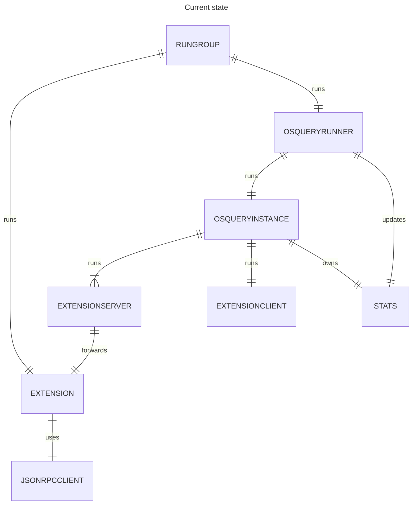
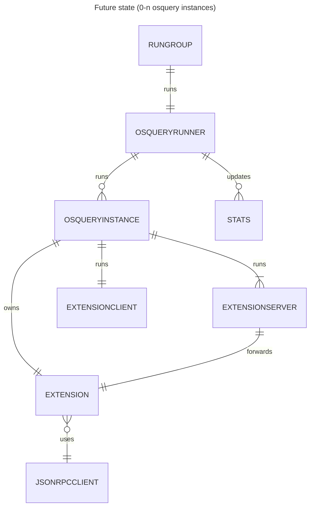

# Osquery extension, runner, and instance refactor

## Status

2024-10-23: ADR submitted to team.

## Context

We want to be able to run between 0 and n osquery instances; currently, we run exactly one. In the short term, we want to be able to split up where Kolide queries run versus where tenant queries run, so that if a tenant creates a query that causes issues with osquery, the Kolide queries will still run. (This amounts to running 2 osquery instances.) In the longer term, we want to support multitenant installations. This will mean 1 osquery instance for Kolide queries, and 1 osquery instance per tenant.

### Current implementation

When we run multiple osquery instances, we will want one osquery extension per osquery instance in order to avoid socket contention and to be able to identify which osquery process is talking to the extension.

In our current implementation, the extension is created by `runLauncher` and run via our rungroup, and passed into the osquery runner for use when creating the instances. To run multiple osquery instances, we would have to create multiple extensions inside `runLauncher`, pass them into the runner, and make sure we adequately map which extension belongs to which osquery instance in the process. This would also require a full launcher restart if the runner needed to increase the number of osquery instances running (for example, if a single-tenant launcher enrolls with a new tenant to become a multi-tenant launcher).

## Decision

To simplify the creation of multiple osquery instances, and to make it possible to increase the number of osquery instances running without performing a full launcher restart, we will move the osquery extension ownership to the osquery instance.

This will also give us the opportunity to make the separation of responsibility between the runner and the instance clearer. The instance will create its own extension, extension server, etc. The runner will be responsible for the instances' state. This means the osquery instance stats should be owned by the runner, since the runner already has the responsibility of updating them.

The below diagram shows the desired future state -- it is identical to the above diagram except for the relationship cardinalities (e.g. `OSQUERYRUNNER` runs 0 or more of `OSQUERYINSTANCE`, rather than exactly 1 `OSQUERYINSTANCE`).

## Consequences

The osquery instance will now be responsible for managing extension health -- if the extension exits, the instance will need to take corrective action. (This is potentially a better outcome than before, since now extension shutdown can be remediated without a full launcher restart.)

This decision does preserve a shared JSONRPC client to talk to Kolide SaaS. If we determine this is not optimal, it would be fairly easy to update to a model where we have one JSONRPC client per extension.

## Changelog

2024-10-23: Initial draft of ADR.
