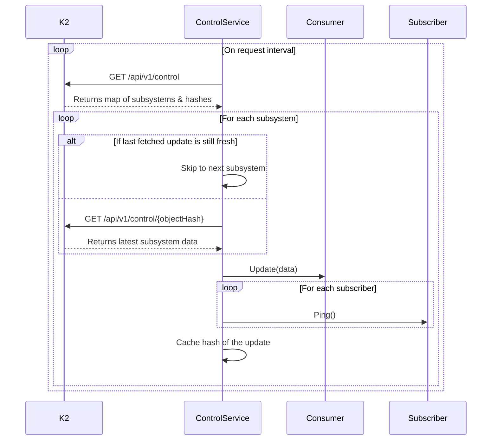

# Control Server

## Functionality

The control server feature enables launcher to periodically query Kolide's SaaS app to receive
data updates for various subsystems of launcher. Each subsystem is a named component and has a hash
of it's data. When the launcher's control service finds a new
update for a subsystem, it notifies a consumer registered to handle updates for the subsystem, then pings all subscribers for the subsystem.

The latest update for each subsystem is cached so the control server can avoid re-sending updates
previously sent to a launcher instance.

## Protocol

