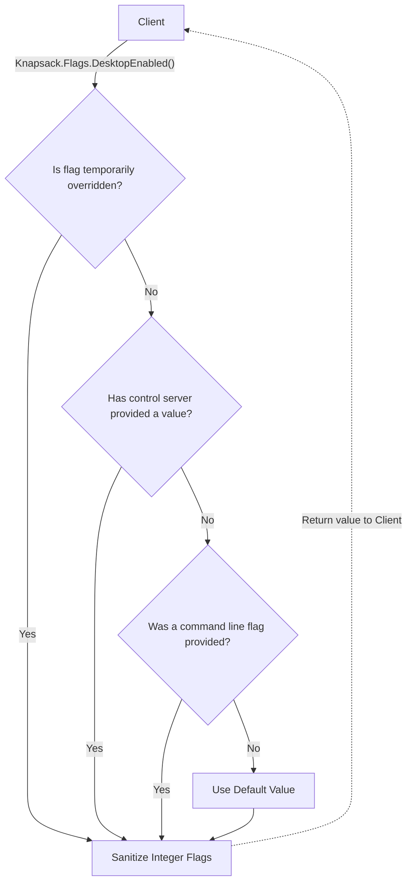
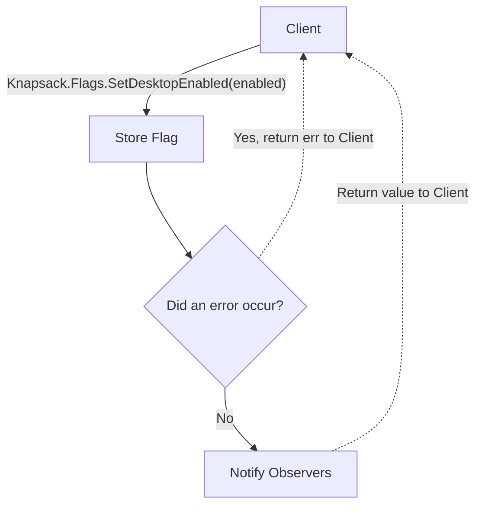
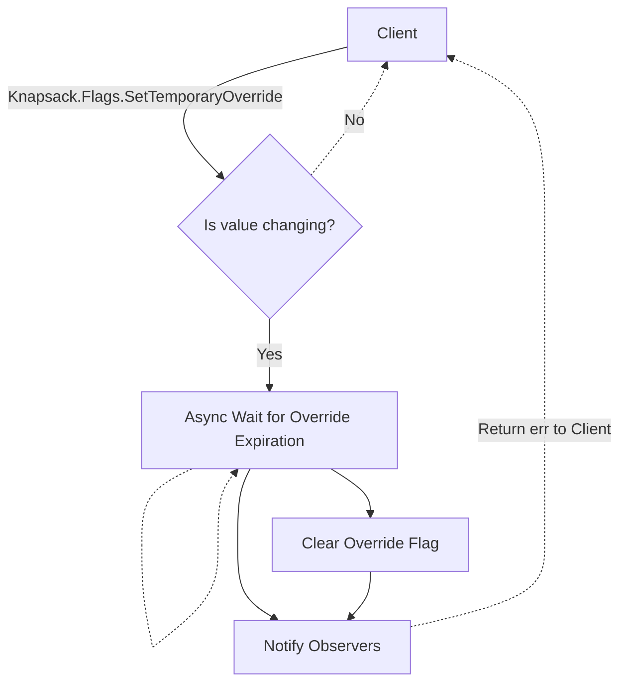

# Knapsack.Flags

The `Flags` interface provides a simple API for storing and retrieving launcher flags at runtime. Currently, flags are of types `bool`, `int64` and `string`.

Launcher flags are identified by a `FlagKey` and can be specified through various means:

- Default values, which are used when no other value has been provided.
- Command line values, which can be fed into launcher via command line options, config files, or environmental variables.
- Control server updates, which are ingested by the control server client and stored in a key-value store.
- Temporary overrides, where a client can request the `Flags` interface to override the current value with a different value for a duration of time.

Launcher flag values can also have constraints defined, which provide safeguards to prevent unreasonable values being used.

## Retrieving Flags

## Storing Flags

## Storing Temporary Overrides

