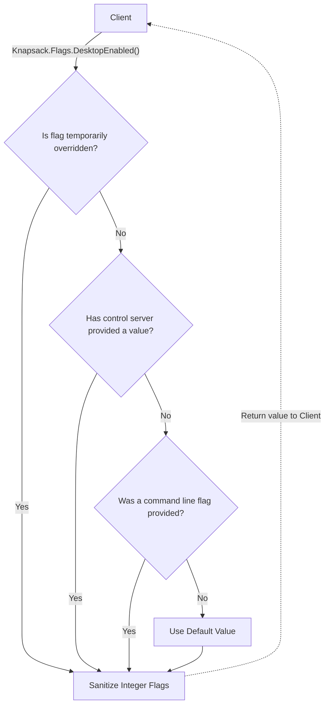
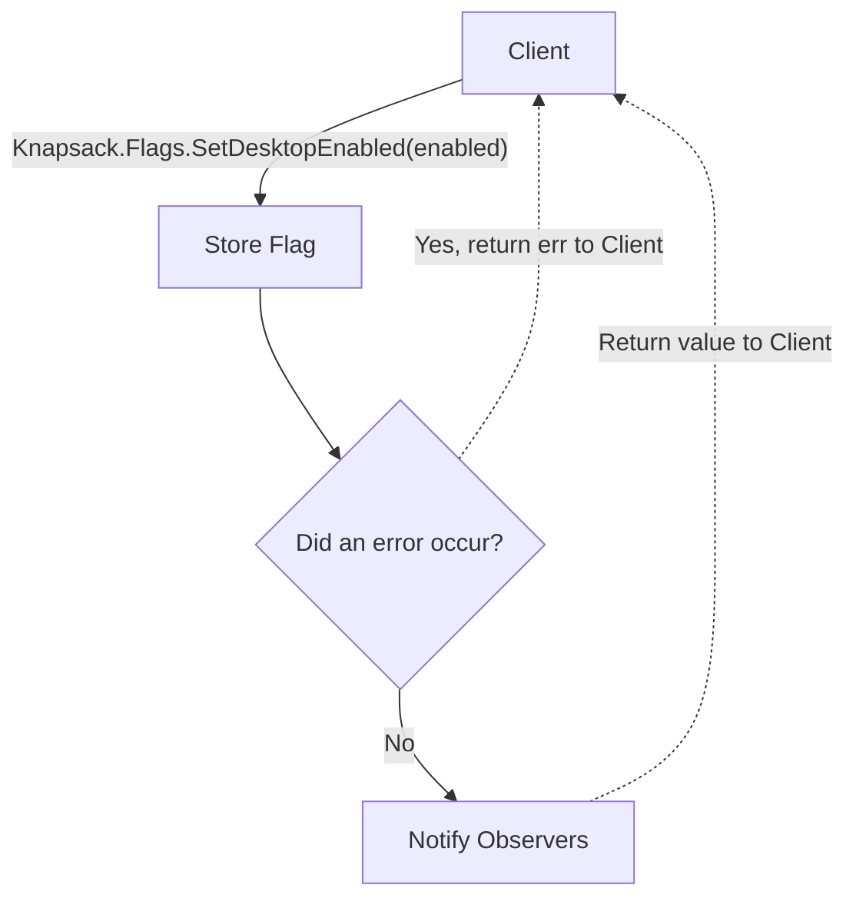
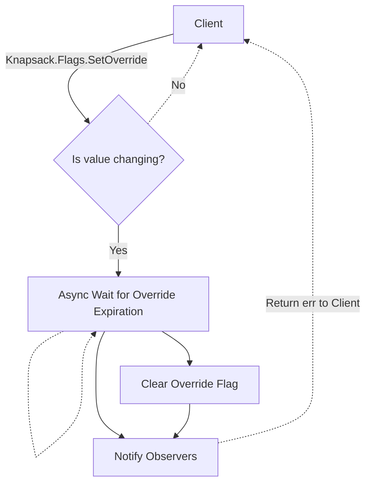

# Knapsack.FlagsA

The `Flags` interface provides a simple API for storing and retrieving launcher flags at runtime. Flags are of type `bool`, `int64` and `string`.

## Retrieving Flags

## Storing Flags

## Storing Temporary Overrides

