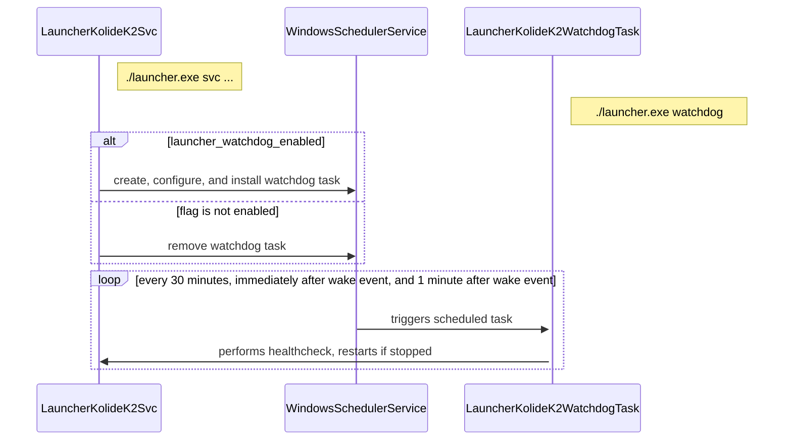

### Watchdog Service

Note that for the initial implementation, this service is windows only. It is intentionally designed to give room for alternate OS implementations if needed in the future.
Most of the relevant code can be found in [ee/watchdog](../../ee/watchdog/)

Here is a basic sequence diagram displaying the enable path for the windows watchdog task. The `launcher_watchdog_enabled` control flag will trigger the initial configuration and installation, and removal of the flag will trigger removal of the task.

You can alternatively install or remove the task for testing/troubleshooting using the `--install-task` and `--remove-task` options for the watchdog subcommand. Note this is intended for developer convenience or emergency usage - the `launcher_watchdog_enabled` flag sent from cloud will eventually override any manual actions.

The restart functionality is currently limited to detecting a stopped state, but the idea here is to lay out the foundation for more advanced healthchecking.
The watchdog task itself runs as a launcher subcommand, performing any required checks/actions and writing all logs to sqlite before exiting. The main invocation of launcher runs a watchdog controller, which responds to the `launcher_watchdog_enabled` flag, and publishes all sqlite logs to debug.json.