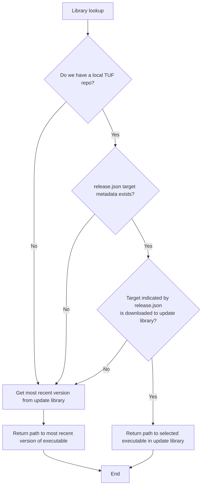

## Library lookup

When launcher looks for the version to run for itself or for osquery, it first
looks through local TUF metadata to see if it knows what version to run for its
given release channel. If it does, and the version is already downloaded, it
will run that version.

Otherwise, it will look for the most recent version downloaded to its update
library.

