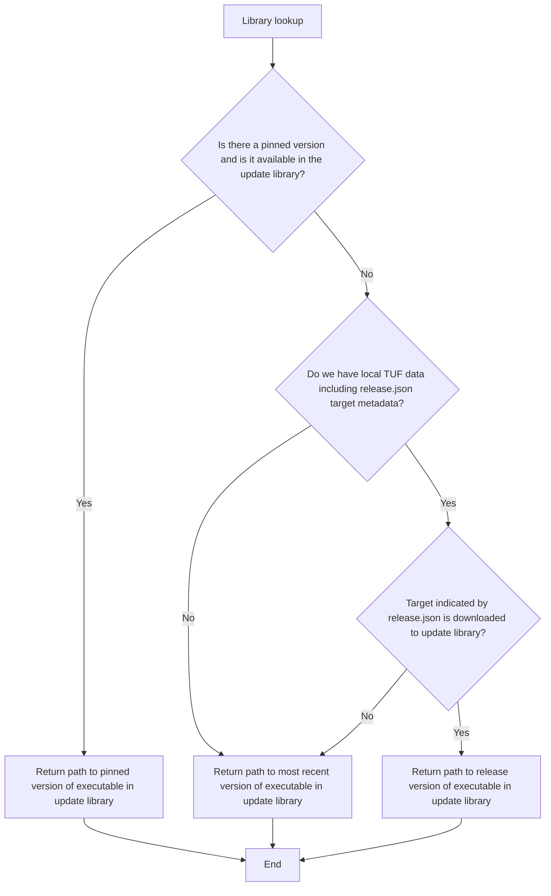

## Library lookup

When launcher looks for the version to run for itself or for osquery, it first
checks to see if a version has been pinned and has already been downloaded; if
it is set and available, it will run that version. If not, launcher looks
through local TUF metadata to see if it knows what version to run for its
given release channel. If it does, and the version is already downloaded, it
will run that version.

Otherwise, it will look for the most recent version downloaded to its update
library.

