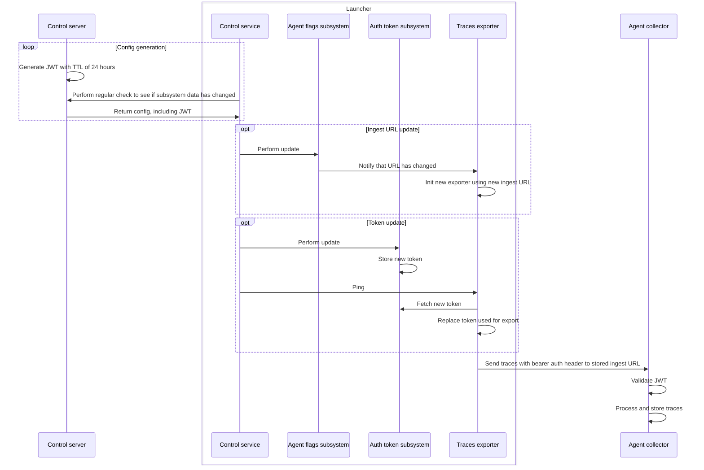

# Observability ingest server

The observability ingest server accepts logs and traces from launcher.

## Authentication for exporting traces and logs

```mermaid
sequenceDiagram
    Participant Control server
    Box Launcher
        Participant Control service
        Participant Agent flags subsystem
        Participant Auth token subsystem
        Participant Traces exporter
    end
    Participant Agent collector

    loop Config generation
        Control server ->> Control server: Generate JWT with TTL of 24 hours
        Control service ->> Control server: Perform regular check to see if subsystem data has changed
        Control server ->> Control service: Return config, including JWT
    end

    opt Ingest URL update
        Control service ->> Agent flags subsystem: Perform update
        Agent flags subsystem ->> Traces exporter: Notify that URL has changed
        Traces exporter ->> Traces exporter: Init new exporter using new ingest URL
    end

    opt Token update
        Control service ->> Auth token subsystem: Perform update
        Auth token subsystem ->> Auth token subsystem: Store new token
        Control service ->> Traces exporter: Ping
        Traces exporter ->> Auth token subsystem: Fetch new token
        Traces exporter ->> Traces exporter: Replace token used for export
    end

    Traces exporter ->> Agent collector: Send traces with bearer auth header to stored ingest URL
    
    Agent collector ->> Agent collector: Validate JWT
    Agent collector ->> Agent collector: Process and store traces
```
