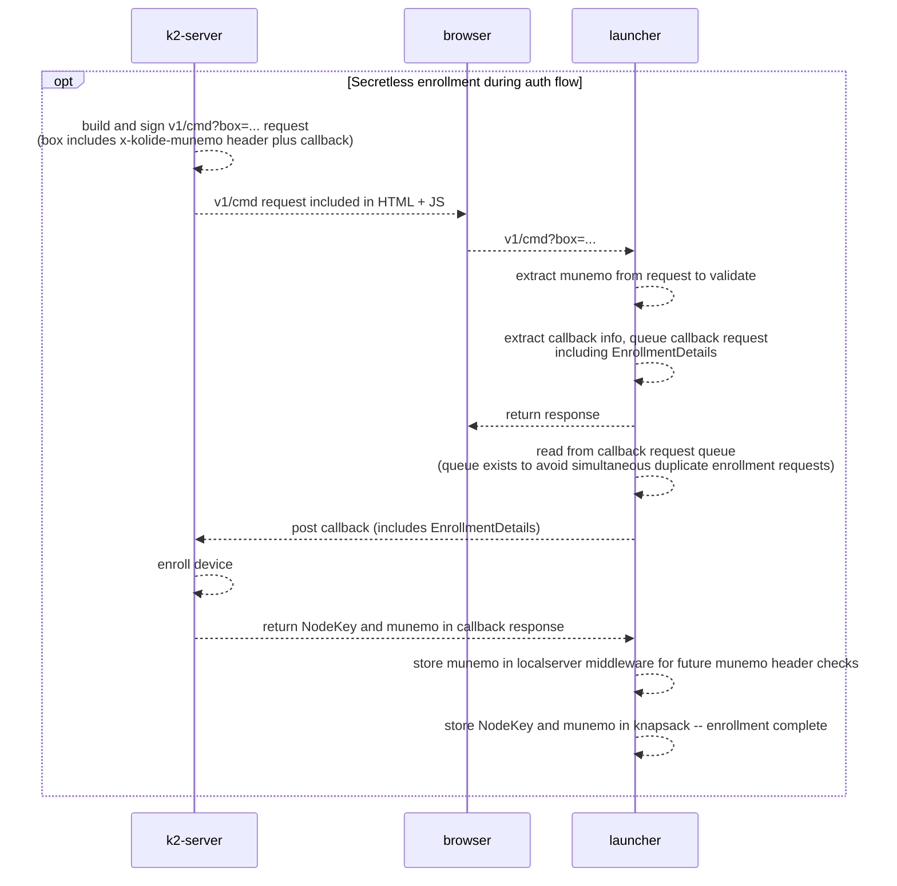

# Secretless launcher installations

## Background

Historically, we have packaged launcher with an "enrollment secret", a JWT that uniquely identifies a tenant. After installation, launcher's osquery extension will make a `RequestEnrollment` request to the device server, including its enrollment secret and its `EnrollmentDetails`. Since these packages are not available publicly, we assume that any device with a valid enrollment secret is allowed to enroll, associated with the tenant given in the JWT; the device server will create a new device record, and return a "node key" that launcher's osquery extension will store and use to authenticate all future device server requests. (The node key is always formatted as `"#{munemo}::#{jwt}"` -- launcher does not currently examine the node key or attempt to extract the munemo from it, but potentially it could.)

Now, we want to stop building per-tenant packages, which means that these new "secretless" packages cannot contain an enrollment secret. Thus, we need a new mechanism to permit "secretless enrollment".

## How secretless enrollment works

### Option 1: secret distribution via MDM

We will expose the enrollment secret in the admin UI, allowing the admin to copy the JWT and distribute it to the well-known location `/etc/kolide-k2/secret` via MDM. As soon as this file exists, on the next osquery extension operation, the extension will use that JWT to perform enrollment in the usual manner. This secretless installation effectively becomes a "regular" launcher installation at this point.

We may choose to add a launcher subcommand (e.g. `launcher enroll <secret>`) in the future, to permit MDM enrollment via script.

### Option 2: enrollment during auth flow

We also permit enrollment during the auth flow. The localserver component of launcher will always include its `EnrollmentDetails` in callback requests. If the k2 server determines that this is a new device that should be enrolled, it will use those `EnrollmentDetails`, plus the data it has access to from the auth flow, to create a new device enrolled in the correct tenant. It will return the tenant's munemo and a new node key in the callback response. The localserver component will store these via the knapsack. The osquery extension will then have access to the new node key, and can proceed with making authenticated requests to the device server.

## Notes on reenrollment

The osquery extension has a mechanism for reenrollment, to handle the case where launcher's node key is corrupted. If the osquery extension receives a "node invalid" response from the device server, it will call `RequestEnrollment` again, including its enrollment secret, and receive a new node key.

For secretless installations that do not receive a secret via MDM, this reenrollment flow will never work -- the extension does not have an enrollment secret to trade for a new node key. Therefore, reenrollment in the osquery extension is disabled for secretless installations. Reenrollment in this case must happen during the auth flow.

## Notes on remote unenroll/uninstall commands (still TBD)

We currently permit both the control server and the device server to send down "uninstall" commands (to the control service's `UninstallConsumer` and to the osquery extension, respectively). The uninstall command wipes the launcher database, removes the enrollment secret file, and stops the launcher service. Removing the enrollment secret file is intended to prevent reenrollment.

With secretless installations that registered via auth flow, we can't remove the enrollment secret file -- so we can't prevent reenrollment. We will need to determine how we want "uninstall" or "unenroll" remote commands to work for secretless installations, keeping in mind future multitenancy support.
