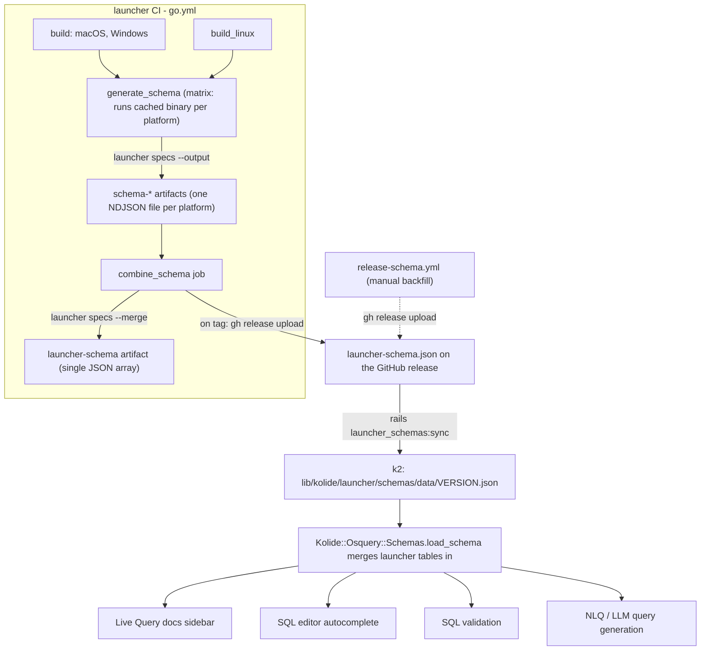

## Table schema publishing

Launcher can emit a machine-readable schema for the osquery tables it provides
(the Launcher and Kolide extension tables). This schema is generated per
platform during launcher CI, combined into a single cross-platform document,
attached to the launcher GitHub release, and ingested by k2 so the tables show
up in Live Query docs, the SQL editor autocomplete, query validation, and
natural-language query generation.

This document describes the expected behavior on both sides (launcher and k2)
and how to exercise the flow locally.

### Scope

The schema covers **only the tables launcher itself registers**: `LauncherTables`
plus `PlatformTables` (see `pkg/osquery/table/table.go`). It deliberately does
**not** include:

- osquery's built-in tables (`processes`, `users`, ...) — k2 already ingests
  those from the upstream osquery schema.
- KATC (Kolide ATC) tables — those are defined and gated server-side in k2 and
  pushed to the agent at runtime via the control server, so they are not known
  to a statically-built launcher binary.

### End-to-end flow



## Launcher behavior

### `launcher specs`

`launcher specs` walks the tables launcher registers and prints each one as a
single line of JSON (NDJSON — one `OsqueryTableSpec` per line) to stdout, or to
a file with `--output`. Each spec contains the table `name`, `description`,
`url`, `platforms`, `columns` (with `name`/`type`/`description`), and optional
`notes`/`examples`.

The output is **platform-specific by construction**: which tables compile into a
given binary is decided at build time by Go build tags
(`platform_tables_{darwin,linux,windows}.go`), and a spec's `platforms` field
defaults to the binary's `GOOS`. A darwin binary therefore emits only the darwin
tables, each marked `"platforms":["darwin"]`. This is why the schema must be
generated on each target platform and then combined — it cannot be produced
cross-platform from a single binary.

Useful flags:

- `--output <file>` — write to a file instead of stdout.
- `--required <field>` (repeatable) — warn (and, unless `--missing-ok`, fail)
  when a spec is missing a field such as `name` or `description`.
- `--quiet` — validate without printing (used by the `lint` workflow).

### `launcher specs --merge`

`launcher specs --merge <file>...` is the combine step. It reads one or more
per-platform spec files and writes a single **JSON array** (the shape k2
ingests), deduplicating tables by name and **unioning their platforms** so a
table available on several platforms ends up with a single entry like
`"platforms":["darwin","linux","windows"]`. The combined list is sorted by table
name. Output goes to stdout or `--output <file>`.

Each input file may be either NDJSON (one spec per line, the `launcher specs`
output) or a single JSON array (the `launcher specs --merge` output); both
compact and pretty-printed forms are accepted, so a previously merged
`launcher-schema.json` can be fed straight back in. Parsing uses `encoding/json`
rather than line scanning, so indentation/newlines inside a spec are irrelevant
and there is no per-line size limit.

A table that appears on more than one platform is expected to expose the **same
column schema** everywhere. Before writing output, the merge compares the columns
(by name and type) of each duplicate against the already-merged entry and
**fails with a non-zero exit** if they diverge — e.g. a column present on one
platform but not another, or the same column with a different type. This prevents
a unioned entry from advertising columns for a platform that does not actually
have them (which would corrupt k2 autocomplete/validation/docs for that
platform). A failure here means a table's definition has drifted across its
platform-specific, build-tagged files and should be reconciled at the source.
Platform lists themselves are not compared (unioning them is the point), and
documentation-only fields such as `description`/`notes` are not treated as part
of the schema.

Implementation: `runSpecs`, `runMergeSpecs`, `mergeSpecFile`, `readSpecs`,
`schemaConflicts`, and `unionPlatforms` in `cmd/launcher/specs.go`; tests in
`cmd/launcher/specs_test.go`.

### CI: generate, combine, publish

In `.github/workflows/go.yml`:

1. **Generate (per platform).** The `generate_schema` job runs on a matrix of
   `[ubuntu-24.04, macos-26, windows-2025]` and `needs: [build, build_linux]`.
   It restores the cached `build/` output (it runs the already-built binary, so
   it needs no checkout or Go toolchain) and runs `launcher specs --output
   launcher-specs-<RUNNER_OS>.json`, uploading each as a `schema-<os>` artifact.
   Running each platform's binary on its own runner is required because the
   schema is platform-specific. Keeping this in its own job (rather than as steps
   inside `build`/`build_linux`) avoids duplicating the step across two jobs and
   avoids the reproducible build twins racing on the artifact name — they don't
   feed `generate_schema`, so they produce no schema artifact at all.
2. **Combine (fan-in).** The `combine_schema` job (`needs: generate_schema`)
   downloads all `schema-*` artifacts and runs
   `go run ./cmd/launcher specs --merge --output launcher-schema.json ...`,
   then uploads the result as the `launcher-schema` artifact. It is part of the
   `ci_mergeable` gate.
3. **Attach to the release (tag builds).** On a tag build
   (`if: github.ref_type == 'tag'`), `combine_schema` has a final step that runs
   `gh release upload <tag> launcher-schema.json --clobber` (the job has
   `contents: write`). Doing this inside the tag's own `ci` run — where the
   freshly combined artifact is already in hand — avoids racing a separate
   release-triggered workflow against `ci`: a release published against a new tag
   fires `release: published` almost immediately, before this `ci` run finishes,
   so a `release`-triggered upload would not yet find a successful run. If no
   release exists for the tag yet, the step emits a notice and skips rather than
   failing the build. The asset name is always `launcher-schema.json`; the
   release tag carries the version.

`.github/workflows/release-schema.yml` is a **manual backfill** (`workflow_dispatch`
with a `tag` input) for the cases the in-`ci` attach can't cover: a tag pushed
before its release existed (so the ci-time upload was skipped), a release cut
from a tag built before schema support landed, or a needed re-attach. It finds
the successful `ci` run for the tag, downloads the `launcher-schema` artifact,
and runs `gh release upload <tag> launcher-schema.json --clobber`.

> Note on immutability: both paths upload to an existing (mutable) release. If
> releases are made immutable, asset attachment must happen at release-creation
> time (e.g. `gh release create --draft ... && gh release edit --draft=false`)
> or be folded into an atomic tag → build → sign → release step. The artifact
> that produces the schema does not change — only where it is attached.


## Local testing

Generate the current platform's schema (NDJSON) without installing anything:

```sh
cd ~/repos/launcher
go run ./cmd/launcher specs --output /tmp/launcher-specs.json
head -1 /tmp/launcher-specs.json   # one JSON object per line
```

Exercise the combine step. On one machine you only have the local platform's
tables, but merging a single file still produces the final JSON-array shape that
k2 ingests:

```sh
go run ./cmd/launcher specs --merge --output /tmp/launcher-schema.json /tmp/launcher-specs.json
jq 'length, .[0].name, .[0].platforms' /tmp/launcher-schema.json
```

To verify platform unioning, hand-write a couple of small NDJSON files with the
same table name and different single-element `platforms` arrays and merge them;
the table should collapse to one entry with the platforms unioned. This is what
`Test_runMergeSpecs` does. Run the tests with:

```sh
go test ./cmd/launcher/ -run 'Test_runSpecs|Test_runMergeSpecs'
```

