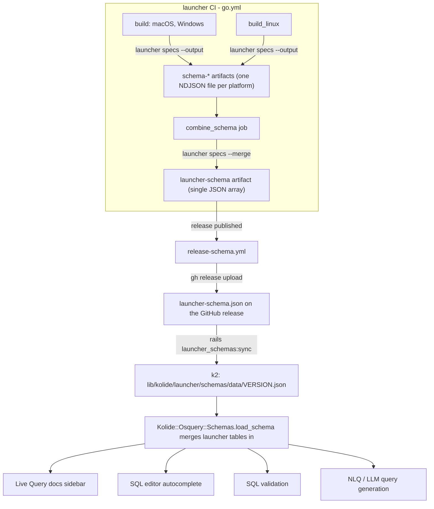

## Table schema publishing

Launcher can emit a machine-readable schema for the osquery tables it provides
(the Launcher and Kolide extension tables). This schema is generated per
platform during launcher CI, combined into a single cross-platform document,
attached to the launcher GitHub release, and ingested by k2 so the tables show
up in Live Query docs, the SQL editor autocomplete, query validation, and
natural-language query generation.

This document describes the expected behavior on both sides (launcher and k2)
and how to exercise the flow locally.

### Scope

The schema covers **only the tables launcher itself registers**: `LauncherTables`
plus `PlatformTables` (see `pkg/osquery/table/table.go`). It deliberately does
**not** include:

- osquery's built-in tables (`processes`, `users`, ...) — k2 already ingests
  those from the upstream osquery schema.
- KATC (Kolide ATC) tables — those are defined and gated server-side in k2 and
  pushed to the agent at runtime via the control server, so they are not known
  to a statically-built launcher binary.

### End-to-end flow



## Launcher behavior

### `launcher specs`

`launcher specs` walks the tables launcher registers and prints each one as a
single line of JSON (NDJSON — one `OsqueryTableSpec` per line) to stdout, or to
a file with `--output`. Each spec contains the table `name`, `description`,
`url`, `platforms`, `columns` (with `name`/`type`/`description`), and optional
`notes`/`examples`.

The output is **platform-specific by construction**: which tables compile into a
given binary is decided at build time by Go build tags
(`platform_tables_{darwin,linux,windows}.go`), and a spec's `platforms` field
defaults to the binary's `GOOS`. A darwin binary therefore emits only the darwin
tables, each marked `"platforms":["darwin"]`. This is why the schema must be
generated on each target platform and then combined — it cannot be produced
cross-platform from a single binary.

Useful flags:

- `--output <file>` — write to a file instead of stdout.
- `--required <field>` (repeatable) — warn (and, unless `--missing-ok`, fail)
  when a spec is missing a field such as `name` or `description`.
- `--quiet` — validate without printing (used by the `lint` workflow).

### `launcher specs --merge`

`launcher specs --merge <file>...` is the combine step. It reads one or more
per-platform NDJSON spec files and writes a single **JSON array** (the shape k2
ingests), deduplicating tables by name and **unioning their platforms** so a
table available on several platforms ends up with a single entry like
`"platforms":["darwin","linux","windows"]`. The combined list is sorted by table
name. Output goes to stdout or `--output <file>`.

Implementation: `runSpecs`, `runMergeSpecs`, `mergeSpecFile`, and
`unionPlatforms` in `cmd/launcher/specs.go`; tests in `cmd/launcher/specs_test.go`.

### CI: generate, combine, publish

In `.github/workflows/go.yml`:

1. **Generate (per platform).** The `build` (macOS, Windows) and `build_linux`
   jobs run the freshly-built binary as `launcher specs --output
   launcher-specs-<RUNNER_OS>.json` and upload it as a `schema-<os>` artifact.
   These steps are gated on `env.CACHE_KEY_PREFIX == ''` so the reproducible
   build twin does not race the main build on the artifact name.
2. **Combine (fan-in).** The `combine_schema` job (`needs: store_artifacts`)
   downloads all `schema-*` artifacts and runs
   `go run ./cmd/launcher specs --merge --output launcher-schema.json ...`,
   then uploads the result as the `launcher-schema` artifact. It is part of the
   `ci_mergeable` gate.

Then in `.github/workflows/release-schema.yml`:

3. **Attach to the release.** On `release: published` (or via `workflow_dispatch`
   with a `tag` input), the workflow finds the successful `ci` run for the tag,
   downloads the `launcher-schema` artifact, and runs
   `gh release upload <tag> launcher-schema.json --clobber` (the job has
   `contents: write`). The asset name is always `launcher-schema.json`; the
   release tag carries the version.

> Note on immutability: attaching after publish works for mutable releases. If
> releases are made immutable, this step should attach the asset at
> release-creation time (e.g. `gh release create --draft ... && gh release edit
> --draft=false`) or be folded into an atomic tag → build → sign → release step.
> The artifact that produces the schema does not change — only where it is
> attached.

## k2 behavior

### Sync (`rails launcher_schemas:sync`)

`lib/tasks/launcher_schemas.rake` fetches
`https://api.github.com/repos/kolide/launcher/releases/latest`. That endpoint
returns **only the release GitHub has marked "Latest"**, which by definition
excludes drafts and prereleases — so nightly/alpha/beta launcher builds are
never ingested and k2 always tracks the current stable launcher schema. The task
finds the `launcher-schema.json` asset, strips a leading `v` from the tag (tags
look like `v2.3.2`), and writes `lib/kolide/launcher/schemas/data/<version>.json`.
The file is then committed in a PR (the data dir is listed in `.ignore` for
search tooling, but the JSON is committed, same as the osquery schema files).

> Coupling requirement: because k2 reads only the "Latest" release, the schema
> asset must ride the stable release that becomes Latest. Nightly/alpha builds
> must be created as prereleases (or not as GitHub releases at all) so they never
> become Latest.

### Loader and merge

`Kolide::Launcher::Schemas` (`lib/kolide/launcher/schemas.rb`) loads the synced
JSON, reusing `Kolide::Osquery::Schemas::Table` since the launcher schema has the
same shape as the osquery schema. `Kolide::Launcher::Schemas.latest` returns an
empty hash when no schema file is present yet, so k2 degrades gracefully to
osquery-only until the first sync.

The single integration point is `Kolide::Osquery::Schemas.load_schema`
(`lib/kolide/osquery/schemas.rb`), which now merges the launcher tables into the
osquery table map:

```ruby
SCHEMAS[version] = Kolide::Launcher::Schemas.latest.merge(osquery_tables)
```

Because every consumer reads that same map (directly or through
`Kolide::Osquery::Schemas::Schema`), the launcher tables automatically appear in:

- **Live Query docs sidebar** — `app/views/live_query/campaigns/_docs.html.erb`
  (the "View on GitHub" link is shown only when a table has a `url`, since many
  launcher tables have none; the fragment cache key includes the launcher schema
  version so it busts when the schema updates).
- **SQL editor autocomplete** — `app/views/api/internal/editor/auto_complete/osquery.json.jbuilder`.
- **SQL validation** — `Schema#valid_query`, used by
  `app/validators/osquery_sql_validator.rb`; launcher tables stop being flagged
  "not found".
- **NLQ / LLM query generation** — `Kolide::Osquery::Schemas::LlmFormatter` and
  the `list_osquery_tables` / `get_osquery_table_schema` LLM tools.

The launcher schema is independent of the osquery version, so the latest launcher
tables are merged regardless of which osquery schema version is loaded. On the
(unlikely) event of a name collision, the osquery definition wins.

## Local testing

### Launcher

Generate the current platform's schema (NDJSON) without installing anything:

```sh
cd ~/repos/launcher
go run ./cmd/launcher specs --output /tmp/launcher-specs.json
head -1 /tmp/launcher-specs.json   # one JSON object per line
```

Exercise the combine step. On one machine you only have the local platform's
tables, but merging a single file still produces the final JSON-array shape that
k2 ingests:

```sh
go run ./cmd/launcher specs --merge --output /tmp/launcher-schema.json /tmp/launcher-specs.json
jq 'length, .[0].name, .[0].platforms' /tmp/launcher-schema.json
```

To verify platform unioning, hand-write a couple of small NDJSON files with the
same table name and different single-element `platforms` arrays and merge them;
the table should collapse to one entry with the platforms unioned. This is what
`Test_runMergeSpecs` does. Run the tests with:

```sh
go test ./cmd/launcher/ -run 'Test_runSpecs|Test_runMergeSpecs'
```

### k2

Since a published release with the asset may not exist yet, drop a schema file in
manually using a locally-generated one, then confirm the surfaces pick it up:

```sh
# Produce a combined schema from your local launcher and place it where k2 loads from.
cd ~/repos/launcher
go run ./cmd/launcher specs --output /tmp/launcher-specs.json
go run ./cmd/launcher specs --merge --output \
  ~/repos/k2/lib/kolide/launcher/schemas/data/0.0.0-local.json /tmp/launcher-specs.json
```

```sh
cd ~/repos/k2

# Loader sees the file:
bundle exec rails runner 'pp Kolide::Launcher::Schemas.latest_version; pp Kolide::Launcher::Schemas.latest.keys.first(5)'

# Launcher tables are merged into the shared schema map:
bundle exec rails runner 'pp Kolide::Osquery::Schemas::Schema.new.find_table_by_name("kolide_launcher_info")&.name'

# Validation now accepts a launcher table (no "not found" error):
bundle exec rails runner 'pp Kolide::Osquery::Schemas::Schema.new.valid_query("select * from kolide_launcher_info").errors'
```

Then load a Live Query page and confirm the launcher tables appear in the docs
sidebar and in editor autocomplete. Remove the temporary
`0.0.0-local.json` when you are done so it is not committed.

To test the real sync path against a launcher release that already carries the
asset (set `GITHUB_TOKEN` to avoid unauthenticated rate limits):

```sh
cd ~/repos/k2
GITHUB_TOKEN=<token> bundle exec rails launcher_schemas:sync
git status lib/kolide/launcher/schemas/data/   # new <version>.json to commit
```
