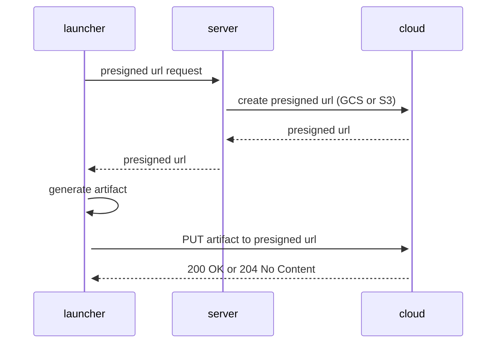
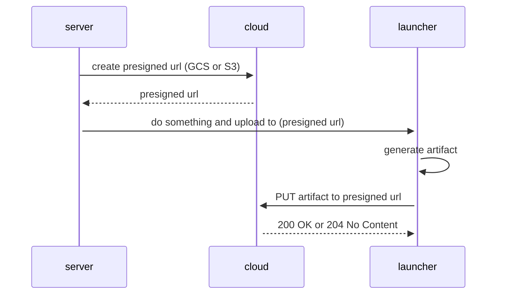

## Flare Upload Flow

The shipper supports uploading flares to both **GCS (Google Cloud Storage)** and **S3 (Amazon S3)** using presigned/signed URLs.

### Shipping initiated by user (cmd line):

### Shipping initiated by server:

## Storage Provider Support

- **GCS**: Returns HTTP 200 OK on successful upload
- **S3**: Returns HTTP 200 OK or 204 No Content on successful upload
