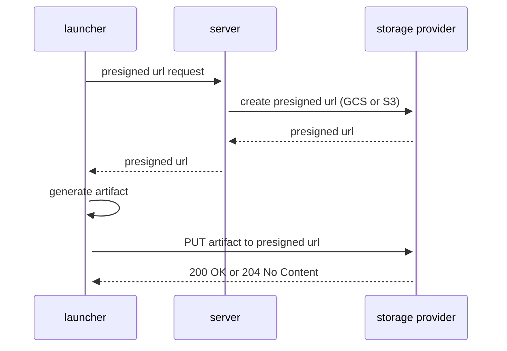
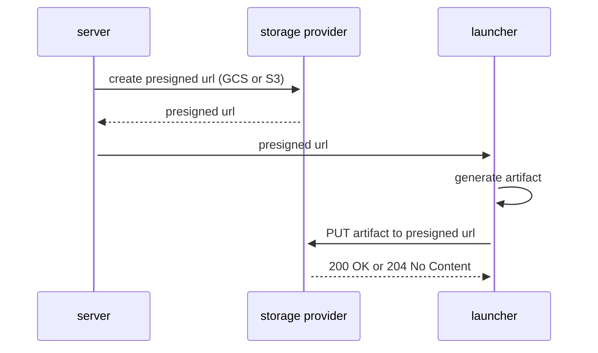

## Flare Upload Flow

The shipper supports uploading flares to both **GCS (Google storage provider Storage)** and **S3 (Amazon S3)** using presigned/signed URLs.

### Shipping initiated by user (cmd line):

### Shipping initiated by server:

## Storage Provider Support

- **GCS**: Returns HTTP 200 OK on successful upload
- **S3**: Returns HTTP 200 OK or 204 No Content on successful upload
- The launcher automatically handles both response codes

## S3 Compatibility

S3 presigned URLs don't support HTTP's `Transfer-Encoding: chunked` header. To work around this:

1. Flares are written to a **temp file** during generation
2. On `Close()`, the file is uploaded with an explicit `Content-Length` header
3. The temp file is automatically cleaned up after upload (success or failure)

This approach avoids holding large flares in memory while ensuring S3 compatibility.
