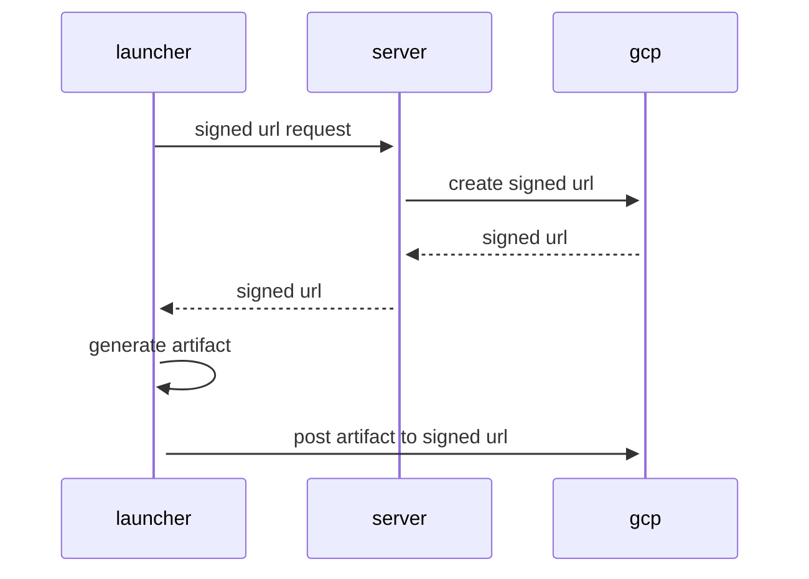
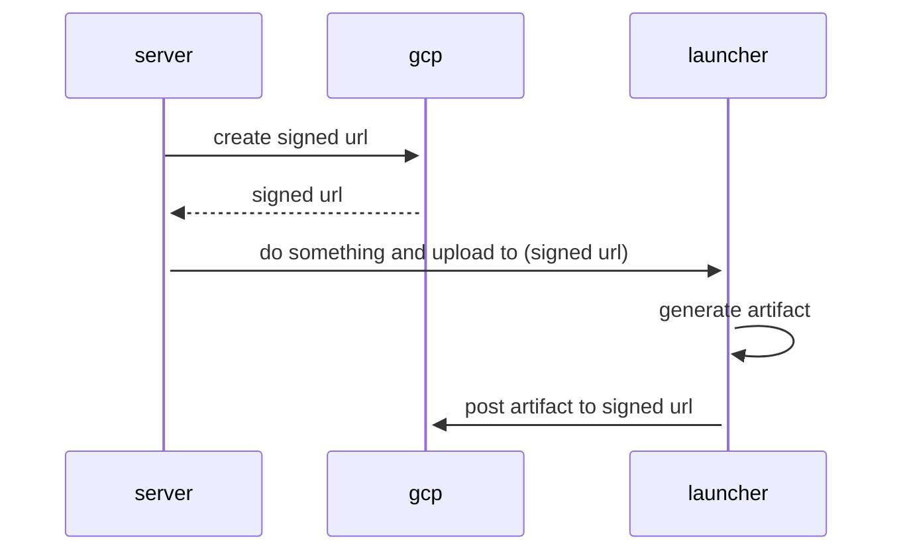

shipping initiated by user (cmd line):

```mermaid
sequenceDiagram
    launcher->>+server: signed url request
    server->>+gcp: create signed url
    gcp-->>+server: signed url
    server-->>+launcher: signed url
    launcher->>+launcher: generate artifact
    launcher->>+gcp: post artifact to signed url
```

shipping initated by server:

```mermaid
sequenceDiagram
    server->>+gcp: create signed url
    gcp-->>+server: signed url
    server->>+launcher: do something and upload to (signed url)
    launcher->>+launcher: generate artifact
    launcher->>+gcp: post artifact to signed url
```
