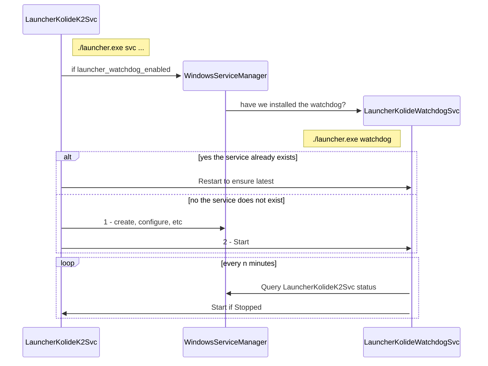

### Watchdog Service

Here is a basic sequence diagram displaying the enable path for the windows watchdog service. The `launcher_watchdog_enabled` control flag will trigger the initial configuration and installation, and removal of the flag will trigger removal of the service.

The restart functionality is currently limited to detecting a stopped state, but the idea here is to lay out the foundation for more advanced healthchecking.
The watchdog service itself runs as a separate invocation of launcher, writing all logs to sqlite. The main invocation of launcher runs a watchdog controller, which responds to the `launcher_watchdog_enabled` flag, and publishes all sqlite logs to debug.json.