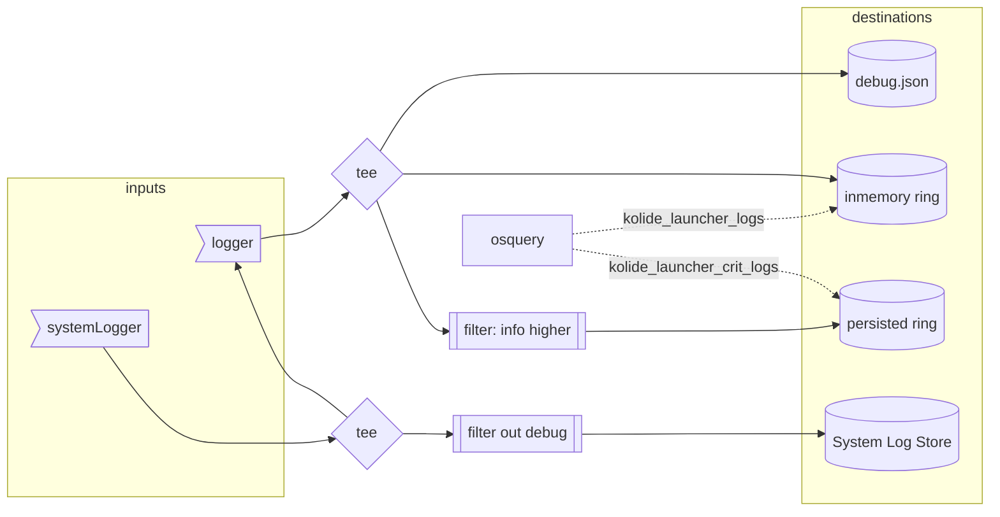

## Logs

```mermaid
flowchart LR
    subgraph inputs
        direction TB
        systemLogger>systemLogger]
        logger>logger]

        %% Force formatting
        systemLogger ~~~ logger
    end

    subgraph destinations
        direction TB
        destSys[(System Log Store)]
        destDebugLog[(debug.json)]
        destMem[(inmemory ring)]
        destStore[(persisted ring)]
    end

    systemLogger --> slTee{tee} --> logger
    slTee --> slFilter[[filter out debug]] --> destSys

    %% force formatting
    logger ~~~ slTee ~~~ systemLogger

    logger --> lTee{tee}
    lTee{tee} --> destDebugLog
    lTee --> destMem
    lTee --> f2[[filter: info higher]] --> destStore

    osquery -. kolide_launcher_logs .-> destMem
    osquery -. kolide_launcher_crit_logs .-> destStore

```
