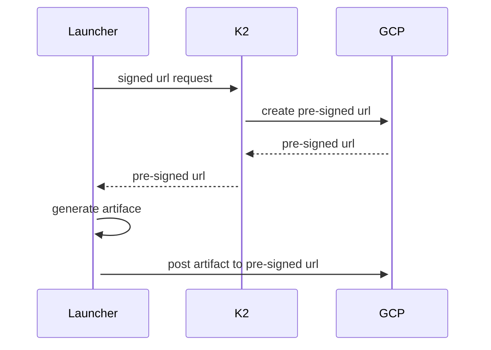

```mermaid
sequenceDiagram
    Launcher->>+K2: signed url request
    K2->>+GCP: create pre-signed url
    GCP-->>+K2: pre-signed url
    K2-->>+Launcher: pre-signed url
    Launcher->>+Launcher: generate artiface
    Launcher->>+GCP: post artifact to pre-signed url
```
